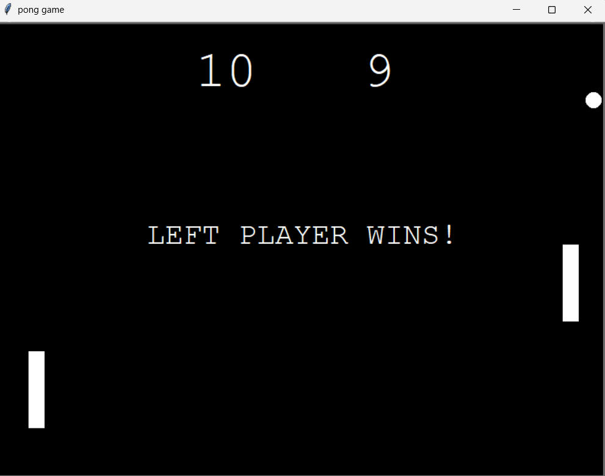

# Pong Game 🏓

A simple Ping Pong game built with Python Turtle.  
Two players can play on the same computer using the keyboard.

---

## Controls

- **Left Paddle**:  
  - Move Up → `W`  
  - Move Down → `S`  

- **Right Paddle**:  
  - Move Up → `Up Arrow`  
  - Move Down → `Down Arrow`  

---

## Game Rules

- The ball moves continuously.  
- If the ball passes a paddle, the opponent scores a point.  
- First player to reach **5 points** wins.  
- Winner is displayed on the screen.

---

## How to Run

1. Make sure Python is installed (3.x recommended).  
2. Open terminal in the project folder.  
3. Run the game:

```bash
python main.py


